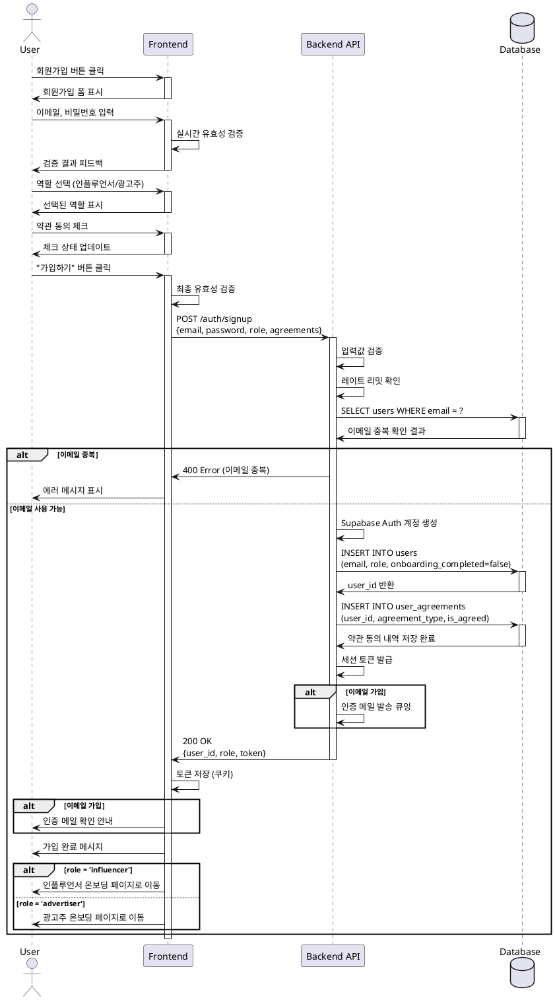

# UC-001: 회원가입 & 역할선택

## Overview
사용자가 플랫폼에 가입하고 역할(인플루언서/광고주)을 선택하는 기능

---

## Primary Actor
- 신규 사용자 (미가입 상태)

---

## Precondition
- 사용자가 인터넷에 연결되어 있음
- 회원가입 페이지에 접근 가능
- 유효한 이메일 주소 보유

---

## Trigger
- 사용자가 홈페이지에서 "회원가입" 버튼 클릭

---

## Main Scenario

### 1. 회원가입 페이지 진입
- 사용자가 회원가입 페이지 접속
- 시스템이 회원가입 폼 표시

### 2. 기본 정보 입력
- 사용자가 이메일 입력
- 사용자가 비밀번호 입력 및 확인 (또는 소셜 로그인 선택)
- 시스템이 실시간 유효성 검증 수행

### 3. 역할 선택
- 사용자가 역할 선택 (인플루언서 또는 광고주)
- 시스템이 선택된 역할 표시

### 4. 약관 동의
- 사용자가 필수 약관 확인 (이용약관, 개인정보처리방침)
- 사용자가 선택 약관 확인 (마케팅 수신 동의)
- 사용자가 필수 약관 동의 체크
- 사용자가 선택 약관 동의 체크 (선택)

### 5. 계정 생성
- 사용자가 "가입하기" 버튼 클릭
- 시스템이 입력값 최종 검증
- 시스템이 이메일 중복 확인
- 시스템이 Supabase Auth로 계정 생성
- 시스템이 users 테이블에 레코드 생성 (role, onboarding_completed=false)
- 시스템이 user_agreements 테이블에 동의 내역 저장

### 6. 이메일 인증 (이메일 가입 시)
- 시스템이 인증 메일 발송
- 사용자에게 메일 확인 안내 표시

### 7. 온보딩으로 이동
- 시스템이 역할별 온보딩 페이지로 리다이렉트
  - 인플루언서: `/onboarding` (인플루언서 정보 등록)
  - 광고주: `/onboarding` (광고주 정보 등록)

---

## Edge Cases

### EC1. 이메일 중복
- **발생**: 입력한 이메일이 이미 가입되어 있음
- **처리**: 에러 메시지 표시, 로그인 페이지 링크 제공

### EC2. 비밀번호 정책 미충족
- **발생**: 비밀번호가 최소 8자, 영문+숫자+특수문자 조합이 아님
- **처리**: 실시간 체크리스트 표시, 제출 차단

### EC3. 필수 약관 미동의
- **발생**: 이용약관 또는 개인정보처리방침 미동의
- **처리**: 제출 시 에러 메시지, 해당 체크박스로 포커스 이동

### EC4. 소셜 로그인 이메일 중복
- **발생**: 소셜 계정 이메일이 기존 이메일 계정과 동일
- **처리**: 계정 연결 안내 또는 기존 계정 로그인 유도

### EC5. 레이트 리밋 초과
- **발생**: 동일 IP에서 5분간 3회 이상 가입 시도
- **처리**: 일시적 차단 메시지, 재시도 가능 시간 표시

### EC6. 네트워크 에러
- **발생**: API 요청 실패 또는 타임아웃
- **처리**: 에러 토스트 표시, "재시도" 버튼 제공

### EC7. 봇 감지
- **발생**: reCAPTCHA 실패
- **처리**: 인증 재시도 요청

### EC8. 이메일 형식 오류
- **발생**: 유효하지 않은 이메일 형식
- **처리**: 실시간 에러 메시지, 제출 차단

---

## Business Rules

### BR1. 역할 선택
- 사용자는 반드시 하나의 역할(인플루언서 또는 광고주)을 선택해야 함
- 역할은 가입 후 변경 불가 (정책에 따라 고객센터 문의 가능)

### BR2. 비밀번호 정책
- 최소 8자 이상
- 영문, 숫자, 특수문자 각 1자 이상 포함
- 이메일과 동일한 비밀번호 불가

### BR3. 약관 동의
- 이용약관 동의 필수
- 개인정보처리방침 동의 필수
- 마케팅 수신 동의 선택
- 약관 동의 내역은 법적 요구사항에 따라 영구 보관

### BR4. 이메일 인증
- 이메일 가입 시 이메일 인증 필수
- 소셜 로그인 시 이메일 자동 인증
- 인증 미완료 시 일부 기능 제한 (정책에 따라)

### BR5. 온보딩 필수
- 회원가입 완료 후 반드시 역할별 온보딩 진행
- 온보딩 미완료 시 (onboarding_completed=false) 주요 기능 사용 불가
  - 인플루언서: 체험단 지원 불가
  - 광고주: 체험단 등록 불가

### BR6. 보안
- 동일 IP에서 5분간 최대 3회 가입 시도 허용
- reCAPTCHA 또는 유사 봇 방지 메커니즘 적용
- 비밀번호는 해싱하여 저장 (Supabase Auth 자동 처리)

### BR7. 개인정보 수집
- 필수: 이메일
- 선택: 마케팅 수신 동의 여부
- 추가 개인정보는 온보딩 단계에서 수집

---

## Sequence Diagram

---

## Post-condition
- users 테이블에 새 레코드 생성 (onboarding_completed=false)
- user_agreements 테이블에 약관 동의 내역 저장
- 세션 토큰 발급 및 저장
- 사용자가 역할별 온보딩 페이지로 이동
- (이메일 가입 시) 인증 메일 발송 대기열에 등록

---

## Related Use Cases
- UC-002: 인플루언서 정보 등록
- UC-003: 광고주 정보 등록

---

## Notes
- Supabase Auth가 비밀번호 해싱 및 세션 관리 자동 처리
- 소셜 로그인 시 OAuth 플로우는 Supabase에서 처리
- 이메일 인증은 비동기로 처리되며 가입 플로우를 차단하지 않음 (정책에 따라)