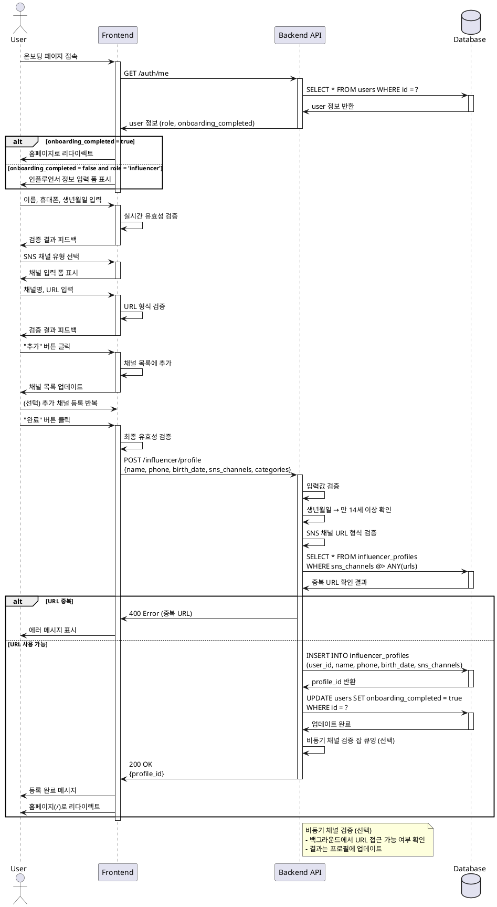

# UC-002: 인플루언서 정보 등록

## Overview
인플루언서가 온보딩 과정에서 기본 정보와 SNS 채널을 등록하는 기능

---

## Primary Actor
- 신규 가입한 인플루언서 (role='influencer', onboarding_completed=false)

---

## Precondition
- 사용자가 회원가입 완료 (UC-001)
- 역할이 '인플루언서'로 설정됨
- 온보딩 미완료 상태 (onboarding_completed=false)
- 로그인 세션 유지 중

---

## Trigger
- 회원가입 완료 후 자동으로 온보딩 페이지로 리다이렉트

---

## Main Scenario

### 1. 온보딩 페이지 진입
- 사용자가 온보딩 페이지 접속
- 시스템이 인플루언서 정보 입력 폼 표시

### 2. 기본 정보 입력
- 사용자가 이름 입력 (2-50자)
- 사용자가 휴대폰번호 입력
- 사용자가 생년월일 선택 (날짜 피커)
- 시스템이 실시간 유효성 검증 수행

### 3. SNS 채널 등록
- 사용자가 "채널 추가" 버튼 클릭
- 시스템이 채널 입력 폼 표시

#### 3.1 첫 번째 채널 등록
- 사용자가 채널 유형 선택 (Naver Blog/YouTube/Instagram/Threads)
- 사용자가 채널명 입력
- 사용자가 채널 URL 입력
- 사용자가 "추가" 버튼 클릭
- 시스템이 URL 형식 검증
- 시스템이 중복 URL 확인
- 시스템이 채널 목록에 추가

#### 3.2 추가 채널 등록 (선택, 최대 4개)
- 사용자가 추가 채널 등록 반복 (최대 4개까지)
- 각 채널마다 3.1 과정 반복

### 4. 주요 활동 카테고리 선택 (선택)
- 사용자가 활동 카테고리 선택 (음식/카페/뷰티/패션/기타)
- 다중 선택 가능

### 5. 정보 저장
- 사용자가 "완료" 버튼 클릭
- 시스템이 최종 유효성 검증
- 시스템이 influencer_profiles 테이블에 레코드 생성
- 시스템이 SNS 채널 정보를 JSONB로 저장
- 시스템이 users.onboarding_completed = true로 업데이트
- 시스템이 비동기 채널 검증 잡 큐잉 (선택)

### 6. 완료 및 홈 이동
- 시스템이 등록 완료 메시지 표시
- 시스템이 홈페이지(`/`)로 리다이렉트
- 사용자가 체험단 탐색 시작 가능

---

## Edge Cases

### EC1. 만 14세 미만
- **발생**: 생년월일 기준 만 14세 미만
- **처리**: 에러 메시지 표시, 서비스 이용 불가 안내

### EC2. SNS 채널 미입력
- **발생**: 최소 1개 채널 등록하지 않음
- **처리**: 제출 시 에러 메시지, 채널 추가 섹션으로 포커스

### EC3. SNS URL 형식 오류
- **발생**: 플랫폼별 URL 패턴과 맞지 않음
- **처리**: 실시간 에러 메시지, 올바른 형식 예시 표시

### EC4. 중복 URL 등록
- **발생**: 다른 사용자가 이미 등록한 URL
- **처리**: 경고 메시지 표시, 등록 차단

### EC5. 동일 채널 중복 추가
- **발생**: 같은 URL을 여러 번 추가 시도
- **처리**: 클라이언트에서 중복 체크, 토스트 메시지

### EC6. 휴대폰번호 형식 오류
- **발생**: 유효하지 않은 전화번호 형식
- **처리**: 실시간 에러 메시지, 하이픈 자동 추가

### EC7. 이름에 특수문자 포함
- **발생**: 한글/영문/공백 외 문자 입력
- **처리**: 입력 필터링 또는 에러 메시지

### EC8. 네트워크 에러
- **발생**: API 요청 실패 또는 타임아웃
- **처리**: 에러 토스트, "재시도" 버튼, 입력값 로컬스토리지 임시 저장

### EC9. 페이지 이탈 시도
- **발생**: 입력 중 브라우저 뒤로가기 또는 페이지 이동
- **처리**: 확인 다이얼로그 표시, 임시저장 옵션 제공

### EC10. 채널 URL 비활성 (비동기 검증)
- **발생**: 백그라운드 검증 시 URL 접근 불가
- **처리**: 프로필에서 경고 표시, 재확인 요청 (차단하지 않음)

---

## Business Rules

### BR1. 필수 입력 항목
- 이름, 휴대폰번호, 생년월일 필수
- SNS 채널 최소 1개 필수

### BR2. 연령 제한
- 만 14세 이상만 서비스 이용 가능
- 생년월일 기준 계산: CURRENT_DATE - birth_date >= 14년

### BR3. SNS 채널 제한
- 최소 1개, 최대 4개 등록 가능
- 지원 플랫폼: Naver Blog, YouTube, Instagram, Threads
- 각 플랫폼별 URL 형식 검증 필수

### BR4. URL 중복 방지
- 동일 URL은 플랫폼 전체에서 한 명만 등록 가능
- 타인이 사용 중인 URL 등록 차단

### BR5. 데이터 저장 형식
- SNS 채널은 JSONB 배열로 저장
- 각 채널 정보: {type, channel_name, url}
- 활동 카테고리는 TEXT[] 배열로 저장

### BR6. 온보딩 완료 조건
- 모든 필수 항목 입력 완료 시 onboarding_completed = true
- 완료 전까지 체험단 지원 기능 사용 불가

### BR7. 비동기 검증 (선택)
- SNS URL 실제 존재 여부는 비동기로 검증
- 검증 결과는 프로필에서 확인 가능
- 검증 실패 시에도 서비스 이용 가능 (경고만 표시)

### BR8. 정보 수정
- 온보딩 완료 후에도 프로필 페이지에서 수정 가능
- SNS 채널 추가/삭제/수정 가능

---

## Sequence Diagram

---

## Post-condition
- influencer_profiles 테이블에 새 레코드 생성
- SNS 채널 정보가 JSONB 배열로 저장
- users.onboarding_completed = true로 업데이트
- 사용자가 홈페이지로 이동
- 체험단 지원 기능 사용 가능
- (선택) 비동기 채널 검증 잡 큐잉

---

## Related Use Cases
- UC-001: 회원가입 & 역할선택
- UC-006: 체험단 지원

---

## Notes
- SNS 채널 검증은 비동기로 처리하여 온보딩 속도 최적화
- URL 중복 체크는 플랫폼 전체 데이터 대상 (성능 고려 필요)
- 만 14세 미만은 서비스 이용 불가 (법적 요구사항)
- 온보딩 완료 후에도 프로필 수정 가능