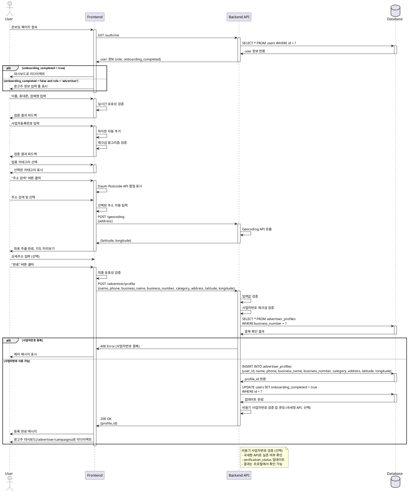

# UC-003: 광고주 정보 등록

## Overview
광고주가 온보딩 과정에서 사업자 정보와 매장 정보를 등록하는 기능

---

## Primary Actor
- 신규 가입한 광고주 (role='advertiser', onboarding_completed=false)

---

## Precondition
- 사용자가 회원가입 완료 (UC-001)
- 역할이 '광고주'로 설정됨
- 온보딩 미완료 상태 (onboarding_completed=false)
- 로그인 세션 유지 중

---

## Trigger
- 회원가입 완료 후 자동으로 온보딩 페이지로 리다이렉트

---

## Main Scenario

### 1. 온보딩 페이지 진입
- 사용자가 온보딩 페이지 접속
- 시스템이 광고주 정보 입력 폼 표시

### 2. 기본 정보 입력
- 사용자가 이름 입력
- 사용자가 휴대폰번호 입력
- 시스템이 실시간 유효성 검증 수행

### 3. 사업자 정보 입력
- 사용자가 업체명 입력
- 사용자가 업종 카테고리 선택 (드롭다운)
- 사용자가 사업자등록번호 입력 (10자리, 하이픈 자동 추가)
- 사용자가 대표자명 입력 (선택)
- 시스템이 사업자번호 형식 검증 (실시간)
- 시스템이 체크섬 알고리즘 검증 (실시간)

### 4. 주소 정보 입력
- 사용자가 "주소 검색" 버튼 클릭
- 시스템이 주소 검색 API 팝업 표시 (Daum Postcode)
- 사용자가 주소 검색 및 선택
- 시스템이 선택된 주소 자동 입력
- 시스템이 Geocoding API로 위도/경도 추출
- 사용자가 상세주소 입력

### 5. 정보 저장
- 사용자가 "완료" 버튼 클릭
- 시스템이 최종 유효성 검증
- 시스템이 사업자번호 중복 확인
- 시스템이 advertiser_profiles 테이블에 레코드 생성
- 시스템이 users.onboarding_completed = true로 업데이트
- 시스템이 비동기 사업자번호 검증 잡 큐잉 (국세청 API, 선택)

### 6. 완료 및 대시보드 이동
- 시스템이 등록 완료 메시지 표시
- 시스템이 광고주 대시보드(`/advertiser/campaigns`)로 리다이렉트
- 사용자가 체험단 등록 시작 가능

---

## Edge Cases

### EC1. 사업자번호 중복
- **발생**: 동일 사업자번호로 이미 가입된 계정 존재
- **처리**: 에러 메시지, 기존 계정 찾기 또는 고객센터 문의 안내

### EC2. 사업자번호 형식 오류
- **발생**: 10자리 숫자가 아니거나 체크섬 검증 실패
- **처리**: 실시간 에러 메시지, 올바른 형식 안내

### EC3. 국세청 API 타임아웃 (비동기 검증)
- **발생**: 사업자번호 실존 여부 확인 실패
- **처리**: 검증 생략하고 진행 또는 관리자 승인 대기 상태

### EC4. 주소 검색 결과 없음
- **발생**: 검색 키워드로 주소를 찾을 수 없음
- **처리**: 안내 메시지, 직접 입력 옵션 제공

### EC5. Geocoding 실패
- **발생**: 주소로 좌표 추출 불가
- **처리**: 좌표 없이 주소만 저장, 지도 기능 제한 안내

### EC6. 업종 카테고리 미선택
- **발생**: 필수 드롭다운 미선택
- **처리**: 제출 시 에러 메시지, 해당 필드로 포커스

### EC7. 휴대폰번호 형식 오류
- **발생**: 유효하지 않은 전화번호
- **처리**: 실시간 에러 메시지, 하이픈 자동 추가

### EC8. 업체명 중복 (다른 사업자번호)
- **발생**: 동일 업체명이지만 다른 사업자번호
- **처리**: 경고 메시지 (여러 지점 가능), 계속 진행 옵션

### EC9. 네트워크 에러
- **발생**: API 요청 실패 또는 타임아웃
- **처리**: 에러 토스트, "재시도" 버튼, 입력값 로컬스토리지 임시 저장

### EC10. 페이지 이탈 시도
- **발생**: 입력 중 브라우저 뒤로가기 또는 페이지 이동
- **처리**: 확인 다이얼로그 표시, 임시저장 옵션 제공

---

## Business Rules

### BR1. 필수 입력 항목
- 이름, 휴대폰번호, 업체명, 사업자등록번호, 업종 카테고리, 주소 필수
- 대표자명, 상세주소 선택

### BR2. 사업자등록번호 검증
- 10자리 숫자 형식 필수
- 체크섬 알고리즘 검증 (한국 사업자번호 규칙)
- 플랫폼 전체에서 고유해야 함 (중복 불가)
- (선택) 국세청 API로 실존 여부 확인

### BR3. 주소 정보
- 도로명 또는 지번 주소 필수
- Geocoding을 통해 위도/경도 자동 추출
- 좌표 추출 실패 시에도 진행 가능 (지도 기능 제한)

### BR4. 데이터 저장 형식
- 사업자번호는 하이픈 제거 후 저장 (1234567890)
- 위도: DECIMAL(10, 8), 경도: DECIMAL(11, 8)

### BR5. 온보딩 완료 조건
- 모든 필수 항목 입력 완료 시 onboarding_completed = true
- 완료 전까지 체험단 등록 기능 사용 불가

### BR6. 비동기 검증 (선택)
- 국세청 API 호출은 비동기로 처리
- 검증 상태: pending, verified, failed
- 검증 실패 시 관리자 승인 또는 재확인 요청

### BR7. 정보 수정
- 온보딩 완료 후에도 프로필 페이지에서 수정 가능
- 사업자번호는 변경 불가 (고객센터 문의)

### BR8. 업체명 중복 허용
- 동일 브랜드의 여러 지점(프랜차이즈) 가능
- 업체명 중복 시 경고만 표시, 등록은 허용

---

## Sequence Diagram

---

## Post-condition
- advertiser_profiles 테이블에 새 레코드 생성
- 사업자 정보와 주소/좌표 저장
- users.onboarding_completed = true로 업데이트
- 사용자가 광고주 대시보드로 이동
- 체험단 등록 기능 사용 가능
- (선택) 비동기 사업자번호 검증 잡 큐잉

---

## Related Use Cases
- UC-001: 회원가입 & 역할선택
- UC-008: 광고주 체험단 관리

---

## Notes
- 사업자번호 검증은 비동기로 처리하여 온보딩 속도 최적화
- 국세청 API는 선택적 기능 (타임아웃 시 생략 가능)
- 주소 검색은 Daum Postcode API 사용 권장
- Geocoding 실패 시에도 서비스 이용 가능 (지도 기능만 제한)
- 사업자번호는 한 번 등록 후 변경 불가 (보안 및 무결성 이유)