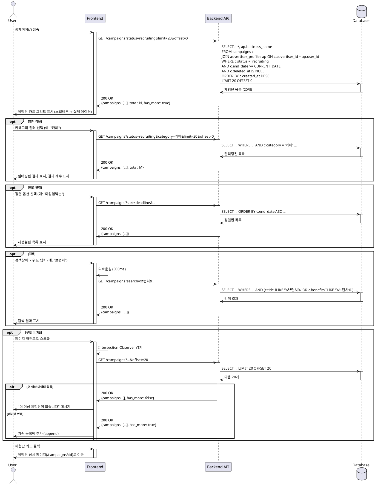

# UC-004: 홈 & 체험단 목록 탐색

## Overview
사용자가 홈페이지에서 모집 중인 체험단 목록을 탐색하고 필터링/정렬/검색하는 기능

---

## Primary Actor
- 모든 사용자 (비로그인 포함)

---

## Precondition
- 사용자가 인터넷에 연결되어 있음
- 홈페이지 접근 가능

---

## Trigger
- 사용자가 홈페이지(`/`) 접속
- 사용자가 네비게이션에서 "홈" 메뉴 클릭

---

## Main Scenario

### 1. 홈페이지 초기 로드
- 사용자가 홈페이지 접속
- 시스템이 모집 중인 체험단 목록 조회
- 시스템이 상단 배너 로드 (공지/추천 체험단)
- 시스템이 체험단 카드 그리드 렌더링 (2-3열)
- 시스템이 초기 20개 체험단 표시 (최신순)

### 2. 체험단 카드 정보 확인
- 사용자가 각 카드에서 다음 정보 확인
  - 썸네일 이미지
  - 체험단명
  - 업체명
  - 카테고리 배지
  - 지역 정보
  - 모집 인원 (예: 5/10명)
  - D-day 표시
  - "모집중" 배지

### 3. 필터 적용 (선택)
- 사용자가 카테고리 필터 선택 (음식점/카페/뷰티/패션/기타)
- 사용자가 지역 필터 선택 (시/도 드롭다운)
- 시스템이 필터링된 목록 표시
- 시스템이 결과 개수 표시 (예: "총 48개 체험단")

### 4. 정렬 변경 (선택)
- 사용자가 정렬 옵션 선택 (최신순/마감임박순/인기순)
- 시스템이 선택된 정렬 기준으로 목록 재정렬

### 5. 검색 (선택)
- 사용자가 검색창에 키워드 입력
- 시스템이 디바운싱 적용 (300ms)
- 시스템이 체험단명 또는 설명에서 키워드 검색
- 시스템이 검색 결과 표시

### 6. 무한 스크롤
- 사용자가 페이지 하단으로 스크롤
- 시스템이 Intersection Observer로 하단 도달 감지
- 시스템이 다음 20개 체험단 로드
- 시스템이 기존 목록에 추가 (append)

### 7. 체험단 상세 이동
- 사용자가 체험단 카드 클릭
- 시스템이 체험단 상세 페이지(`/campaigns/:id`)로 이동

---

## Edge Cases

### EC1. 체험단 목록 비어있음
- **발생**: 등록된 모집 중 체험단이 없음
- **처리**: 빈 상태 UI 표시, 안내 메시지

### EC2. 필터링 결과 없음
- **발생**: 선택한 필터 조건에 맞는 체험단 없음
- **처리**: 빈 상태 UI, "필터 초기화" 버튼 제공

### EC3. 검색 결과 없음
- **발생**: 검색 키워드에 맞는 체험단 없음
- **처리**: 빈 상태 UI, "검색 초기화" 버튼 제공

### EC4. 무한 스크롤 끝
- **발생**: 더 이상 로드할 체험단 없음
- **처리**: 로딩 인디케이터 숨김, 안내 메시지 (더 이상 체험단이 없습니다)

### EC5. 썸네일 이미지 로드 실패
- **발생**: 이미지 URL 404 또는 네트워크 에러
- **처리**: placeholder 이미지 표시

### EC6. 네트워크 타임아웃
- **발생**: API 요청 실패
- **처리**: 에러 메시지, "재시도" 버튼 제공

### EC7. 검색어에 특수문자 포함 (SQL Injection 시도)
- **발생**: 악의적인 쿼리 시도
- **처리**: 입력값 sanitize, 파라미터 바인딩으로 안전하게 처리

### EC8. 동시에 여러 필터 적용
- **발생**: 카테고리 + 지역 + 검색 동시 사용
- **처리**: AND 조건으로 결합하여 검색

### EC9. 빠른 연속 필터 변경
- **발생**: 사용자가 빠르게 여러 필터 클릭
- **처리**: 디바운싱 적용, 마지막 입력만 API 요청

### EC10. 페이지네이션 offset 오버플로우
- **발생**: 존재하지 않는 페이지 요청
- **처리**: 빈 배열 반환, 무한 스크롤 종료

---

## Business Rules

### BR1. 표시 대상
- status = 'recruiting' (모집중) 체험단만 표시
- end_date >= 현재 날짜인 체험단만 표시
- deleted_at이 NULL인 체험단만 표시

### BR2. 기본 정렬
- 최신순: created_at DESC (기본값)
- 마감임박순: end_date ASC
- 인기순: view_count 또는 applicants_count DESC

### BR3. 페이지네이션
- 초기 로드: 20개
- 무한 스크롤 시: 20개씩 추가
- Offset 또는 Cursor 기반 페이지네이션

### BR4. 필터링
- 카테고리: 단일 선택
- 지역: 단일 선택 (시/도 단위)
- 복수 필터 동시 적용 가능 (AND 조건)

### BR5. 검색
- 검색 대상: campaigns.title, campaigns.benefits
- 대소문자 구분 없음 (ILIKE)
- 디바운싱 300ms 적용
- 최소 2자 이상 입력 시 검색

### BR6. 접근 권한
- 비로그인 사용자도 목록 조회 가능
- 모든 역할(인플루언서/광고주) 조회 가능

### BR7. 성능 최적화
- 복합 인덱스 활용: (status, end_date, created_at)
- 이미지 lazy loading 적용
- 스켈레톤 UI로 로딩 상태 표시

### BR8. D-day 계산
- D-day = end_date - CURRENT_DATE
- D-day가 0이면 "오늘 마감"
- D-day가 음수면 모집 종료 (표시 안 함)

---

## Sequence Diagram

---

## Post-condition
- 사용자가 모집 중인 체험단 목록 확인
- 필터/정렬/검색 조건이 URL 쿼리 파라미터에 반영 (북마크 가능)
- 선택한 체험단의 상세 페이지로 이동 가능

---

## Related Use Cases
- UC-005: 체험단 상세
- UC-006: 체험단 지원

---

## Notes
- 비로그인 사용자도 접근 가능하여 SEO 최적화 필요
- 이미지 lazy loading으로 초기 로딩 속도 최적화
- 필터/정렬/검색 조건은 URL에 반영하여 공유 가능
- 복합 인덱스 활용으로 쿼리 성능 최적화