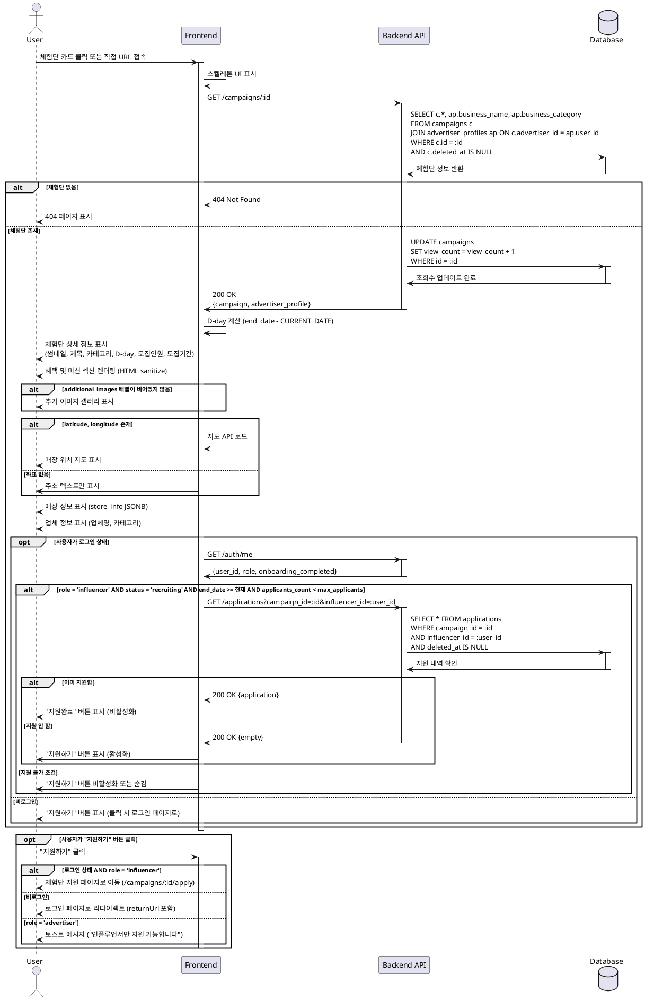

# UC-005: 체험단 상세

## Overview
사용자가 체험단 카드를 클릭하여 상세 정보를 조회하는 기능

---

## Primary Actor
- 모든 사용자 (비로그인 포함)

---

## Precondition
- 사용자가 인터넷에 연결되어 있음
- 체험단이 존재하고 삭제되지 않음 (deleted_at IS NULL)

---

## Trigger
- 사용자가 홈페이지에서 체험단 카드 클릭
- 사용자가 직접 URL로 체험단 상세 페이지 접속 (`/campaigns/:id`)

---

## Main Scenario

### 1. 상세 페이지 진입
- 사용자가 체험단 카드 클릭
- 시스템이 체험단 상세 페이지로 라우팅
- 시스템이 스켈레톤 UI 표시

### 2. 체험단 정보 로드
- 시스템이 campaigns 테이블에서 체험단 조회
- 시스템이 advertiser_profiles 테이블에서 업체 정보 조회 (JOIN)
- 시스템이 조회수 증가 (view_count + 1)
- 시스템이 현재 모집 인원 확인 (applicants_count)

### 3. 상단 정보 표시
- 시스템이 썸네일 이미지 표시
- 시스템이 체험단명 표시
- 시스템이 카테고리 배지 표시
- 시스템이 모집 상태 배지 표시 ("모집중" / "모집종료")
- 시스템이 D-day 계산 및 표시
- 시스템이 모집 인원 표시 (예: 5/10명)
- 시스템이 모집 기간 표시 (start_date ~ end_date)

### 4. 혜택 및 미션 표시
- 시스템이 "제공 혜택" 섹션 렌더링 (HTML)
- 시스템이 "미션" 섹션 렌더링 (HTML)
- 시스템이 "주의사항" 표시 (notes가 있는 경우)

### 5. 추가 이미지 갤러리
- 시스템이 additional_images 배열 조회
- 시스템이 이미지 갤러리 표시 (라이트박스 지원)

### 6. 매장 정보 표시
- 시스템이 store_info JSONB 파싱
- 시스템이 매장명, 주소, 전화번호, 영업시간 표시
- 시스템이 지도 API로 매장 위치 표시 (latitude, longitude)

### 7. 업체 정보 표시
- 시스템이 업체명 표시
- 시스템이 업체 카테고리 표시

### 8. 지원 버튼 표시 (조건부)
- 시스템이 사용자 로그인 상태 확인
- 시스템이 체험단 모집 상태 확인
- 시스템이 지원 가능 여부 판단
  - 로그인 상태
  - role='influencer'
  - status='recruiting'
  - end_date >= 현재 날짜
  - applicants_count < max_applicants

### 9. 지원하기 (인플루언서)
- 사용자가 "지원하기" 버튼 클릭
- 시스템이 체험단 지원 페이지로 이동 (UC-006)

---

## Edge Cases

### EC1. 존재하지 않는 체험단 ID
- **발생**: URL의 campaign_id가 데이터베이스에 없음
- **처리**: 404 페이지 표시, "체험단을 찾을 수 없습니다" 안내

### EC2. 삭제된 체험단
- **발생**: deleted_at이 NULL이 아님
- **처리**: 404 페이지 또는 "삭제된 체험단입니다" 안내

### EC3. 썸네일 이미지 로드 실패
- **발생**: 이미지 URL 404 또는 네트워크 에러
- **처리**: placeholder 이미지 표시

### EC4. 지도 API 로드 실패
- **발생**: 좌표 정보 없음 또는 지도 API 에러
- **처리**: 지도 섹션 숨김, 주소 텍스트만 표시

### EC5. 비로그인 사용자가 지원 시도
- **발생**: 로그인하지 않은 사용자가 "지원하기" 버튼 클릭
- **처리**: 로그인 페이지로 리다이렉트 (returnUrl 포함)

### EC6. 광고주가 지원 시도
- **발생**: role='advertiser'인 사용자가 지원 시도
- **처리**: 토스트 메시지 ("인플루언서만 지원 가능합니다"), 버튼 비활성화

### EC7. 모집 마감된 체험단
- **발생**: status='ended' 또는 end_date < 현재 날짜
- **처리**: "모집종료" 배지 표시, 지원 버튼 비활성화

### EC8. 모집 인원 초과
- **발생**: applicants_count >= max_applicants
- **처리**: "모집마감" 배지 표시, 지원 버튼 비활성화

### EC9. 이미 지원한 체험단
- **발생**: 로그인한 인플루언서가 이미 지원한 체험단
- **처리**: "지원완료" 버튼 표시 (비활성화), 토스트 안내

### EC10. HTML 콘텐츠에 악성 스크립트
- **발생**: benefits, missions 필드에 XSS 시도
- **처리**: DOMPurify 등으로 sanitize, 안전한 HTML만 렌더링

### EC11. 추가 이미지 배열 비어있음
- **발생**: additional_images가 빈 배열 []
- **처리**: 이미지 갤러리 섹션 숨김

### EC12. store_info JSONB 필드 누락
- **발생**: store_info에 일부 필드 없음 (예: phone 없음)
- **처리**: 누락된 필드는 표시하지 않음, 에러 없이 스킵

---

## Business Rules

### BR1. 표시 대상
- deleted_at이 NULL인 체험단만 표시
- 모든 status 체험단 표시 가능 (recruiting, ended)

### BR2. 접근 권한
- 비로그인 사용자도 상세 조회 가능
- 모든 역할(인플루언서/광고주) 조회 가능

### BR3. 조회수 증가
- 상세 페이지 로드 시마다 view_count + 1
- 중복 조회 방지 없음 (단순 카운트)
- 비동기로 처리 (페이지 렌더링 차단하지 않음)

### BR4. D-day 계산
- D-day = end_date - CURRENT_DATE
- D-day가 0이면 "오늘 마감"
- D-day가 음수면 "모집종료"

### BR5. 지원 가능 조건
- 로그인 상태 AND
- role='influencer' AND
- status='recruiting' AND
- end_date >= CURRENT_DATE AND
- applicants_count < max_applicants AND
- 해당 인플루언서가 이미 지원하지 않음

### BR6. HTML 콘텐츠 렌더링
- benefits, missions 필드는 HTML 형식
- 반드시 sanitize 처리 (XSS 방지)
- 허용 태그: h1-h6, p, ul, ol, li, strong, em, a
- 차단 태그: script, iframe, embed, object

### BR7. 이미지 처리
- 썸네일: 단일 URL (thumbnail_url)
- 추가 이미지: JSONB 배열 (additional_images)
- Lazy loading 적용
- 실패 시 placeholder 표시

### BR8. 지도 표시
- latitude, longitude가 모두 있어야 지도 표시
- 좌표 없으면 주소 텍스트만 표시
- Kakao Map 또는 Naver Map API 사용

### BR9. 매장 정보 형식
- store_info는 JSONB 객체
- 필수 필드: store_name, address, phone, hours
- 선택 필드: latitude, longitude
- 누락 필드는 표시하지 않음

### BR10. SEO 최적화
- 메타 태그 설정 (title, description, og:image)
- 비로그인 접근 가능하므로 SSR 적용
- Open Graph 태그로 공유 최적화

---

## Sequence Diagram

---

## Post-condition
- 사용자가 체험단의 상세 정보 확인
- 조회수 증가 (view_count + 1)
- 인플루언서는 지원 가능 여부 확인
- 지원 조건 충족 시 지원 페이지로 이동 가능

---

## Related Use Cases
- UC-004: 홈 & 체험단 목록 탐색
- UC-006: 체험단 지원
- UC-001: 회원가입 & 역할선택 (비로그인 사용자가 지원 시도 시)

---

## Notes
- 비로그인 사용자도 접근 가능하여 SEO 최적화 필수 (SSR)
- 조회수는 중복 방지 없이 단순 카운트 (향후 쿠키 기반 중복 방지 검토 가능)
- HTML 콘텐츠는 반드시 sanitize 처리 (XSS 방지)
- 지도 API는 좌표가 있을 때만 표시
- 이미지는 lazy loading으로 초기 로딩 속도 최적화
- Open Graph 태그로 SNS 공유 최적화