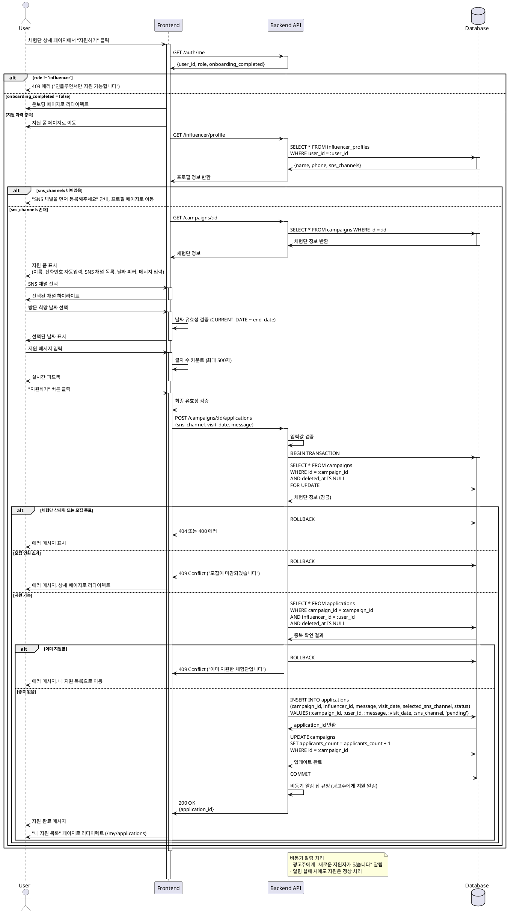

# UC-006: 체험단 지원

## Overview
인플루언서가 체험단에 지원서를 제출하는 기능

---

## Primary Actor
- 로그인한 인플루언서 (role='influencer', onboarding_completed=true)

---

## Precondition
- 사용자가 로그인 상태
- 역할이 '인플루언서'
- 온보딩 완료 (onboarding_completed=true)
- 체험단이 모집 중 (status='recruiting')
- 모집 마감일이 지나지 않음 (end_date >= 현재 날짜)
- 모집 인원 미달 (applicants_count < max_applicants)
- 해당 체험단에 이미 지원하지 않음

---

## Trigger
- 사용자가 체험단 상세 페이지에서 "지원하기" 버튼 클릭

---

## Main Scenario

### 1. 지원 페이지 진입
- 사용자가 "지원하기" 버튼 클릭
- 시스템이 지원 자격 재검증
- 시스템이 지원 폼 페이지로 이동 (`/campaigns/:id/apply`)
- 시스템이 체험단 정보 요약 표시

### 2. 인플루언서 프로필 정보 로드
- 시스템이 influencer_profiles에서 사용자 프로필 조회
- 시스템이 SNS 채널 목록 조회 (sns_channels JSONB)
- 시스템이 이름, 휴대폰번호 자동 입력

### 3. SNS 채널 선택
- 시스템이 등록된 SNS 채널 목록 표시
- 사용자가 사용할 SNS 채널 선택 (단일 선택)
- 시스템이 선택된 채널 하이라이트

### 4. 방문 희망 날짜 선택
- 사용자가 날짜 피커로 방문 희망 날짜 선택
- 시스템이 선택 가능 범위 제한 (CURRENT_DATE ~ end_date)
- 시스템이 선택된 날짜 표시

### 5. 지원 메시지 입력
- 사용자가 지원 메시지 입력 (텍스트 영역)
- 시스템이 글자 수 카운트 표시 (최대 500자)
- 시스템이 실시간 유효성 검증

### 6. 지원서 제출
- 사용자가 "지원하기" 버튼 클릭
- 시스템이 최종 유효성 검증
  - 모든 필수 필드 입력 확인
  - SNS 채널 선택 확인
  - 방문 날짜 유효성 확인
  - 메시지 길이 확인
- 시스템이 체험단 모집 상태 재확인 (동시성 제어)

### 7. 지원 데이터 저장
- 시스템이 applications 테이블에 레코드 생성
- 시스템이 campaigns.applicants_count + 1 업데이트
- 시스템이 트랜잭션으로 원자성 보장

### 8. 지원 완료 안내
- 시스템이 지원 완료 메시지 표시
- 시스템이 "내 지원 목록" 페이지로 리다이렉트 (`/my/applications`)
- 시스템이 광고주에게 알림 발송 (선택, 비동기)

---

## Edge Cases

### EC1. 중복 지원 시도
- **발생**: 이미 지원한 체험단에 다시 지원 시도
- **처리**: 에러 메시지, "이미 지원한 체험단입니다", 내 지원 목록으로 이동

### EC2. 온보딩 미완료
- **발생**: onboarding_completed=false인 사용자가 접근
- **처리**: 온보딩 페이지로 리다이렉트, "프로필 등록을 완료해주세요" 안내

### EC3. SNS 채널 미등록
- **발생**: influencer_profiles의 sns_channels가 빈 배열
- **처리**: 프로필 수정 페이지로 안내, "SNS 채널을 먼저 등록해주세요"

### EC4. 모집 마감 (동시성)
- **발생**: 제출 중 다른 사용자가 마지막 자리 선점
- **처리**: 409 Conflict, "모집이 마감되었습니다", 상세 페이지로 리다이렉트

### EC5. 방문 날짜 범위 초과
- **발생**: 과거 날짜 또는 end_date 이후 날짜 선택
- **처리**: 실시간 에러 메시지, 올바른 범위 안내

### EC6. 메시지 길이 초과
- **발생**: 500자 초과 입력
- **처리**: 실시간 에러 메시지, 입력 차단 또는 자동 자르기

### EC7. 광고주가 지원 시도
- **발생**: role='advertiser'인 사용자가 URL로 직접 접근
- **처리**: 403 Forbidden, "인플루언서만 지원 가능합니다"

### EC8. 네트워크 에러
- **발생**: API 요청 실패 또는 타임아웃
- **처리**: 에러 토스트, "재시도" 버튼, 입력값 로컬스토리지 임시 저장

### EC9. 체험단 삭제됨
- **발생**: 제출 중 광고주가 체험단 삭제
- **처리**: 404 에러, "체험단이 삭제되었습니다", 홈으로 리다이렉트

### EC10. 페이지 이탈 시도
- **발생**: 입력 중 브라우저 뒤로가기 또는 페이지 이동
- **처리**: 확인 다이얼로그, "작성 중인 내용이 사라집니다"

---

## Business Rules

### BR1. 필수 입력 항목
- SNS 채널 선택 필수 (단일 선택)
- 방문 희망 날짜 필수
- 지원 메시지 필수 (최소 10자, 최대 500자)

### BR2. 지원 자격
- role='influencer' 필수
- onboarding_completed=true 필수
- SNS 채널 최소 1개 등록 필수

### BR3. 지원 가능 조건
- status='recruiting'
- end_date >= CURRENT_DATE
- applicants_count < max_applicants
- 해당 인플루언서가 이미 지원하지 않음 (applications 중복 체크)

### BR4. 방문 날짜 범위
- 최소: CURRENT_DATE (오늘)
- 최대: end_date (모집 마감일)
- 과거 날짜 선택 불가

### BR5. SNS 채널 선택
- influencer_profiles.sns_channels에서 1개 선택
- 선택된 채널 정보는 JSONB 객체로 저장
- {type, channel_name, url} 형식

### BR6. 동시성 제어
- 지원서 제출 시 applicants_count와 max_applicants 재확인
- 트랜잭션으로 INSERT와 UPDATE 원자성 보장
- 낙관적 잠금(Optimistic Locking) 사용

### BR7. 데이터 저장
- applications 테이블에 레코드 생성
- status='pending' (대기 상태)
- campaigns.applicants_count + 1 업데이트
- 트랜잭션 실패 시 롤백

### BR8. 중복 지원 방지
- (campaign_id, influencer_id) 조합으로 중복 체크
- deleted_at IS NULL인 레코드만 확인
- 중복 시 409 Conflict 응답

### BR9. 알림 (선택)
- 지원 완료 시 광고주에게 알림 발송 (비동기)
- 알림 실패 시에도 지원은 정상 처리

### BR10. 입력값 검증
- 메시지: 최소 10자, 최대 500자
- 날짜: ISO 8601 형식 (YYYY-MM-DD)
- SNS 채널: 등록된 채널 중 하나

---

## Sequence Diagram

---

## Post-condition
- applications 테이블에 새 레코드 생성 (status='pending')
- campaigns.applicants_count + 1 업데이트
- 사용자가 "내 지원 목록" 페이지로 이동
- 지원 내역 조회 가능
- (선택) 광고주에게 알림 발송

---

## Related Use Cases
- UC-005: 체험단 상세
- UC-007: 내 지원 목록
- UC-002: 인플루언서 정보 등록 (SNS 채널 미등록 시)
- UC-009: 광고주 체험단 상세 & 모집 관리 (광고주 측 지원자 확인)

---

## Notes
- 동시성 제어를 위해 트랜잭션과 FOR UPDATE 사용
- 모집 마감 직전 동시 지원 시 먼저 처리된 요청만 성공
- 입력값 로컬스토리지 임시 저장으로 네트워크 에러 대응
- 알림 기능은 비동기로 처리하여 지원 플로우 차단하지 않음
- 방문 날짜는 광고주 참고용 (확정 날짜 아님)
- 지원 후 수정/취소는 별도 기능으로 제공 가능 (확장)