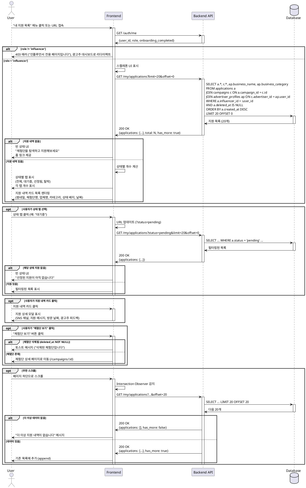

# UC-007: 내 지원 목록 (인플루언서 전용)

## Overview
인플루언서가 자신이 지원한 체험단 목록과 지원 상태를 확인하는 기능

---

## Primary Actor
- 로그인한 인플루언서 (role='influencer', onboarding_completed=true)

---

## Precondition
- 사용자가 로그인 상태
- 역할이 '인플루언서'
- 온보딩 완료 (onboarding_completed=true)

---

## Trigger
- 사용자가 네비게이션에서 "내 지원 목록" 메뉴 클릭
- 사용자가 직접 URL로 접속 (`/my/applications`)
- 체험단 지원 완료 후 자동 리다이렉트

---

## Main Scenario

### 1. 내 지원 목록 페이지 진입
- 사용자가 "내 지원 목록" 메뉴 클릭
- 시스템이 로그인 및 역할 검증
- 시스템이 스켈레톤 UI 표시

### 2. 지원 목록 조회
- 시스템이 applications 테이블에서 사용자의 지원 내역 조회
- 시스템이 campaigns 테이블 JOIN (체험단 정보)
- 시스템이 advertiser_profiles 테이블 JOIN (업체 정보)
- 시스템이 최신순 정렬 (created_at DESC)

### 3. 상태별 탭 표시
- 시스템이 상태별 탭 표시
  - 전체 (모든 상태)
  - 대기중 (status='pending')
  - 선정됨 (status='selected')
  - 탈락 (status='rejected')
- 시스템이 각 탭의 개수 표시 (예: 대기중 3건)

### 4. 지원 목록 렌더링
- 시스템이 각 지원 내역 카드 표시
  - 체험단 썸네일
  - 체험단명
  - 업체명
  - 카테고리 배지
  - 지원 상태 배지 (대기중/선정됨/탈락)
  - 지원 날짜 (created_at)
  - 방문 희망 날짜 (visit_date)
  - 체험단 모집 기간 (start_date ~ end_date)

### 5. 지원 상세 확인
- 사용자가 지원 내역 카드 클릭
- 시스템이 지원 상세 모달 또는 페이지 표시
  - 지원한 SNS 채널
  - 작성한 지원 메시지
  - 광고주 피드백 (있는 경우)
  - 체험단 상세 페이지 링크

### 6. 상태별 필터링 (선택)
- 사용자가 상태 탭 선택
- 시스템이 선택된 상태의 지원 목록만 표시
- 시스템이 URL 쿼리 파라미터 업데이트 (예: ?status=pending)

### 7. 체험단 상세 이동
- 사용자가 "체험단 보기" 버튼 클릭
- 시스템이 체험단 상세 페이지로 이동 (`/campaigns/:id`)

---

## Edge Cases

### EC1. 지원 내역 없음
- **발생**: 사용자가 아직 아무 체험단에도 지원하지 않음
- **처리**: 빈 상태 UI 표시, "체험단을 탐색하고 지원해보세요" 안내, 홈 링크

### EC2. 특정 상태 지원 내역 없음
- **발생**: 선택한 탭에 해당하는 지원 내역 없음 (예: "선정됨" 0건)
- **처리**: 빈 상태 UI, "선정된 지원이 아직 없습니다" 안내

### EC3. 체험단 삭제됨
- **발생**: 지원한 체험단이 광고주에 의해 삭제됨
- **처리**: 체험단 정보를 회색으로 표시, "삭제된 체험단입니다" 배지, 상세 페이지 링크 비활성화

### EC4. 광고주가 접근 시도
- **발생**: role='advertiser'인 사용자가 URL로 직접 접근
- **처리**: 403 Forbidden, "인플루언서 전용 페이지입니다", 광고주 대시보드로 리다이렉트

### EC5. 썸네일 이미지 로드 실패
- **발생**: 이미지 URL 404 또는 네트워크 에러
- **처리**: placeholder 이미지 표시

### EC6. 네트워크 에러
- **발생**: API 요청 실패 또는 타임아웃
- **처리**: 에러 메시지, "재시도" 버튼 제공

### EC7. 선정된 체험단 모집 기간 지남
- **발생**: status='selected'이지만 end_date < 현재 날짜
- **처리**: "모집 종료" 배지 추가 표시, 기한 경과 안내

### EC8. 대기 중 체험단 모집 마감
- **발생**: status='pending'이지만 end_date < 현재 날짜
- **처리**: "모집 종료" 배지, 상태는 pending 유지 (광고주가 아직 처리 안 함)

### EC9. 지원 메시지 미입력 (레거시 데이터)
- **발생**: 과거 데이터에 message가 NULL 또는 빈 문자열
- **처리**: "(메시지 없음)" 표시

### EC10. 페이지네이션 끝
- **발생**: 무한 스크롤 또는 페이지네이션 끝
- **처리**: "더 이상 지원 내역이 없습니다" 안내

---

## Business Rules

### BR1. 접근 권한
- role='influencer' 필수
- onboarding_completed=true 필수
- 본인의 지원 내역만 조회 가능 (RLS 정책)

### BR2. 조회 조건
- deleted_at IS NULL인 지원 내역만 표시
- 본인의 user_id와 일치하는 지원만 조회
- 기본 정렬: created_at DESC (최신순)

### BR3. 상태 종류
- pending: 대기 중 (광고주 미확인)
- selected: 선정됨 (광고주가 선정)
- rejected: 탈락 (광고주가 거절)

### BR4. 상태별 필터링
- 전체: 모든 상태 표시
- 대기중: status='pending'
- 선정됨: status='selected'
- 탈락: status='rejected'

### BR5. 조인 정보
- applications 기준으로 campaigns, advertiser_profiles JOIN
- 체험단이 삭제되어도 (deleted_at NOT NULL) 지원 내역은 유지
- 삭제된 체험단은 회색 처리 및 안내 표시

### BR6. 페이지네이션
- 초기 로드: 20개
- 무한 스크롤 또는 페이지네이션: 20개씩 추가
- Offset 또는 Cursor 기반

### BR7. 상세 정보 표시
- 지원 메시지 (message)
- 선택한 SNS 채널 (selected_sns_channel JSONB)
- 방문 희망 날짜 (visit_date)
- 지원 날짜 (created_at)
- 광고주 피드백 (feedback, 있는 경우)

### BR8. 삭제된 체험단 처리
- campaigns.deleted_at이 NOT NULL인 경우
- 체험단 정보는 표시하되 "삭제됨" 표시
- 상세 페이지 링크 비활성화

### BR9. URL 쿼리 파라미터
- 상태 필터링은 URL에 반영 (예: ?status=pending)
- 북마크 및 공유 가능

### BR10. 실시간 업데이트 (선택)
- 광고주가 상태 변경 시 알림 (선택)
- 페이지 재방문 시 최신 상태 반영

---

## Sequence Diagram

---

## Post-condition
- 사용자가 자신의 모든 지원 내역 확인
- 각 지원의 상태 (대기/선정/탈락) 확인
- 상태별 필터링 가능
- 선택한 필터 조건이 URL에 반영 (북마크 가능)
- 체험단 상세 페이지로 이동 가능

---

## Related Use Cases
- UC-006: 체험단 지원
- UC-005: 체험단 상세
- UC-009: 광고주 체험단 상세 & 모집 관리 (광고주 측 지원자 관리)

---

## Notes
- 본인의 지원 내역만 조회 가능 (RLS 정책으로 보호)
- 삭제된 체험단의 지원 내역도 유지 (히스토리 보존)
- 상태 변경은 광고주가 수행 (인플루언서는 조회만 가능)
- 향후 지원 취소 기능 추가 가능 (확장)
- 알림 기능으로 상태 변경 시 실시간 푸시 가능 (선택)