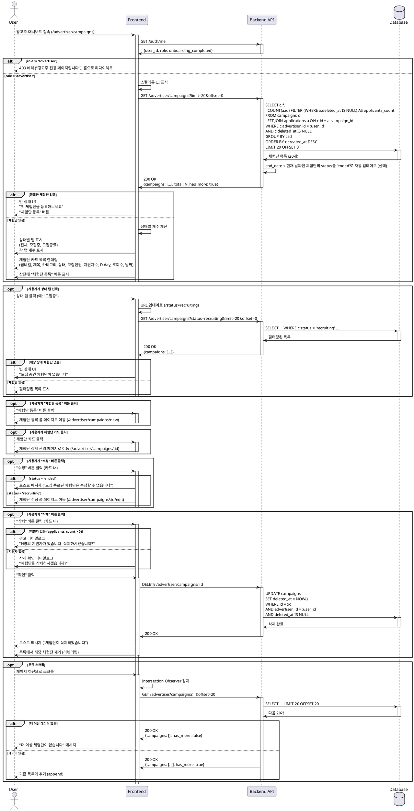

# UC-008: 광고주 체험단 관리

## Overview
광고주가 자신이 등록한 체험단 목록을 조회하고 관리하는 기능

---

## Primary Actor
- 로그인한 광고주 (role='advertiser', onboarding_completed=true)

---

## Precondition
- 사용자가 로그인 상태
- 역할이 '광고주'
- 온보딩 완료 (onboarding_completed=true)

---

## Trigger
- 사용자가 로그인 후 광고주 대시보드로 자동 리다이렉트
- 사용자가 네비게이션에서 "내 체험단" 메뉴 클릭
- 사용자가 직접 URL로 접속 (`/advertiser/campaigns`)

---

## Main Scenario

### 1. 체험단 관리 페이지 진입
- 사용자가 광고주 대시보드 접속
- 시스템이 로그인 및 역할 검증
- 시스템이 스켈레톤 UI 표시

### 2. 체험단 목록 조회
- 시스템이 campaigns 테이블에서 사용자의 체험단 조회
- 시스템이 advertiser_id = user_id 조건으로 필터링
- 시스템이 최신순 정렬 (created_at DESC)

### 3. 상태별 탭 표시
- 시스템이 상태별 탭 표시
  - 전체 (모든 상태)
  - 모집중 (status='recruiting')
  - 모집종료 (status='ended')
- 시스템이 각 탭의 개수 표시 (예: 모집중 2건)

### 4. 체험단 목록 렌더링
- 시스템이 각 체험단 카드 표시
  - 썸네일 이미지
  - 체험단명
  - 카테고리 배지
  - 상태 배지 (모집중/모집종료)
  - 모집 인원 (예: 5/10명)
  - 지원자 수 (applicants_count)
  - D-day 표시
  - 조회수 (view_count)
  - 등록일 (created_at)

### 5. "체험단 등록" 버튼
- 시스템이 상단에 "체험단 등록" 버튼 표시
- 사용자가 버튼 클릭 시 체험단 등록 폼 페이지로 이동

### 6. 상태별 필터링 (선택)
- 사용자가 상태 탭 선택
- 시스템이 선택된 상태의 체험단만 표시
- 시스템이 URL 쿼리 파라미터 업데이트 (예: ?status=recruiting)

### 7. 체험단 상세 관리 이동
- 사용자가 체험단 카드 클릭
- 시스템이 체험단 상세 관리 페이지로 이동 (`/advertiser/campaigns/:id`)

### 8. 체험단 수정
- 사용자가 "수정" 버튼 클릭 (카드 내 액션)
- 시스템이 체험단 수정 폼 페이지로 이동 (`/advertiser/campaigns/:id/edit`)

### 9. 체험단 삭제
- 사용자가 "삭제" 버튼 클릭 (카드 내 액션)
- 시스템이 삭제 확인 다이얼로그 표시
- 사용자가 확인
- 시스템이 soft delete 수행 (deleted_at = NOW())
- 시스템이 목록에서 제거

---

## Edge Cases

### EC1. 등록한 체험단 없음
- **발생**: 광고주가 아직 체험단을 등록하지 않음
- **처리**: 빈 상태 UI 표시, "첫 체험단을 등록해보세요" 안내, "체험단 등록" 버튼

### EC2. 특정 상태 체험단 없음
- **발생**: 선택한 탭에 해당하는 체험단 없음 (예: "모집중" 0건)
- **처리**: 빈 상태 UI, "모집 중인 체험단이 없습니다" 안내

### EC3. 인플루언서가 접근 시도
- **발생**: role='influencer'인 사용자가 URL로 직접 접근
- **처리**: 403 Forbidden, "광고주 전용 페이지입니다", 홈으로 리다이렉트

### EC4. 썸네일 이미지 로드 실패
- **발생**: 이미지 URL 404 또는 네트워크 에러
- **처리**: placeholder 이미지 표시

### EC5. 삭제 시도 중 지원자 존재
- **발생**: 지원자가 있는 체험단 삭제 시도
- **처리**: 경고 다이얼로그, "N명의 지원자가 있습니다. 삭제하시겠습니까?", 확인 시 삭제 진행

### EC6. 모집 마감일 자동 종료
- **발생**: end_date가 지났지만 status='recruiting'인 체험단
- **처리**: 자동으로 status='ended'로 변경 (배치 작업 또는 조회 시 처리)

### EC7. 네트워크 에러
- **발생**: API 요청 실패 또는 타임아웃
- **처리**: 에러 메시지, "재시도" 버튼 제공

### EC8. 삭제 실패 (동시성)
- **발생**: 삭제 요청 중 다른 사용자가 해당 체험단에 지원
- **처리**: 트랜잭션으로 보호, 실패 시 에러 메시지

### EC9. 페이지네이션 끝
- **발생**: 무한 스크롤 또는 페이지네이션 끝
- **처리**: "더 이상 체험단이 없습니다" 안내

### EC10. 모집 인원 초과 (데이터 불일치)
- **발생**: applicants_count > max_applicants (버그 또는 동시성 이슈)
- **처리**: 빨간색 경고 표시, 관리자 확인 필요

---

## Business Rules

### BR1. 접근 권한
- role='advertiser' 필수
- onboarding_completed=true 필수
- 본인이 등록한 체험단만 조회 가능 (RLS 정책)

### BR2. 조회 조건
- deleted_at IS NULL인 체험단만 표시
- advertiser_id = user_id 조건
- 기본 정렬: created_at DESC (최신순)

### BR3. 상태 종류
- recruiting: 모집 중 (end_date >= 현재 날짜)
- ended: 모집 종료 (end_date < 현재 날짜 또는 수동 종료)

### BR4. 상태별 필터링
- 전체: 모든 상태 표시
- 모집중: status='recruiting'
- 모집종료: status='ended'

### BR5. 체험단 수정
- 모집 중인 체험단만 수정 가능
- 지원자가 있는 경우 일부 필드 수정 제한 (예: max_applicants 감소 불가)
- 모집 종료된 체험단은 수정 불가

### BR6. 체험단 삭제
- soft delete 방식 (deleted_at = NOW())
- 지원자 데이터는 유지 (히스토리 보존)
- 삭제된 체험단은 목록에서 제거되지만 DB에는 남음

### BR7. 페이지네이션
- 초기 로드: 20개
- 무한 스크롤 또는 페이지네이션: 20개씩 추가
- Offset 또는 Cursor 기반

### BR8. D-day 계산
- D-day = end_date - CURRENT_DATE
- D-day가 0이면 "오늘 마감"
- D-day가 음수면 "모집종료"

### BR9. 상태 자동 업데이트
- end_date < 현재 날짜인 체험단은 자동으로 status='ended'로 변경
- 배치 작업 또는 조회 시 처리

### BR10. URL 쿼리 파라미터
- 상태 필터링은 URL에 반영 (예: ?status=recruiting)
- 북마크 및 공유 가능

---

## Sequence Diagram

---

## Post-condition
- 사용자가 자신이 등록한 모든 체험단 확인
- 각 체험단의 상태 (모집중/모집종료) 확인
- 지원자 수 및 조회수 확인
- 상태별 필터링 가능
- 체험단 수정/삭제 가능
- 선택한 필터 조건이 URL에 반영 (북마크 가능)

---

## Related Use Cases
- UC-009: 광고주 체험단 상세 & 모집 관리
- UC-003: 광고주 정보 등록

---

## Notes
- 본인이 등록한 체험단만 조회 가능 (RLS 정책으로 보호)
- soft delete 방식으로 데이터 히스토리 보존
- 모집 마감일 지난 체험단은 자동으로 status='ended'로 변경 (배치 또는 조회 시)
- 지원자가 있는 체험단 삭제 시 경고 표시
- 체험단 등록 기능은 별도 페이지 (/advertiser/campaigns/new)
- 체험단 수정은 모집 중인 체험단만 가능