# UC-009: 광고주 체험단 상세 & 모집 관리

## Overview
광고주가 자신이 등록한 체험단의 상세 정보와 지원자 목록을 확인하고 선정/탈락 처리하는 기능

---

## Primary Actor
- 로그인한 광고주 (role='advertiser', onboarding_completed=true)

---

## Precondition
- 사용자가 로그인 상태
- 역할이 '광고주'
- 온보딩 완료 (onboarding_completed=true)
- 조회하려는 체험단이 본인이 등록한 것 (advertiser_id = user_id)
- 체험단이 삭제되지 않음 (deleted_at IS NULL)

---

## Trigger
- 사용자가 "내 체험단" 목록에서 체험단 카드 클릭
- 사용자가 직접 URL로 접속 (`/advertiser/campaigns/:id`)

---

## Main Scenario

### 1. 체험단 상세 관리 페이지 진입
- 사용자가 체험단 카드 클릭
- 시스템이 권한 검증 (본인 체험단인지 확인)
- 시스템이 스켈레톤 UI 표시

### 2. 체험단 정보 로드
- 시스템이 campaigns 테이블에서 체험단 조회
- 시스템이 applications 테이블에서 지원자 목록 조회
- 시스템이 influencer_profiles 테이블 JOIN (지원자 정보)

### 3. 체험단 정보 표시
- 시스템이 체험단 기본 정보 표시
  - 썸네일 및 추가 이미지
  - 체험단명, 카테고리
  - 모집 기간 (start_date ~ end_date)
  - 모집 인원 (현재/최대)
  - 조회수 (view_count)
  - 상태 배지 (모집중/모집종료)
  - D-day
- 시스템이 혜택, 미션, 주의사항 표시
- 시스템이 매장 정보 표시

### 4. 지원자 목록 탭
- 시스템이 지원자 상태별 탭 표시
  - 전체 (모든 지원자)
  - 대기중 (status='pending')
  - 선정됨 (status='selected')
  - 탈락 (status='rejected')
- 시스템이 각 탭의 개수 표시 (예: 대기중 3명)

### 5. 지원자 목록 렌더링
- 시스템이 각 지원자 카드 표시
  - 인플루언서 이름
  - 선택한 SNS 채널 (type, channel_name, url)
  - 방문 희망 날짜
  - 지원 메시지
  - 지원 날짜 (created_at)
  - 상태 배지 (대기중/선정됨/탈락)

### 6. 지원자 상세 확인
- 사용자가 지원자 카드 확장 또는 클릭
- 시스템이 지원자의 전체 프로필 표시
  - 이름, 휴대폰번호
  - 모든 SNS 채널 목록
  - 활동 카테고리
  - 지원 메시지 전체
- 시스템이 SNS 채널 링크 제공 (외부 링크)

### 7. 지원자 선정
- 사용자가 "선정" 버튼 클릭
- 시스템이 확인 다이얼로그 표시
- 사용자가 확인
- 시스템이 applications.status를 'selected'로 업데이트
- 시스템이 지원자에게 선정 알림 발송 (비동기, 선택)
- 시스템이 지원자 카드 상태 업데이트

### 8. 지원자 탈락
- 사용자가 "탈락" 버튼 클릭
- 시스템이 확인 다이얼로그 표시
- 사용자가 피드백 메시지 입력 (선택)
- 사용자가 확인
- 시스템이 applications.status를 'rejected'로 업데이트
- 시스템이 피드백 메시지 저장 (입력된 경우)
- 시스템이 지원자에게 알림 발송 (비동기, 선택)
- 시스템이 지원자 카드 상태 업데이트

### 9. 상태별 필터링 (선택)
- 사용자가 상태 탭 선택
- 시스템이 선택된 상태의 지원자만 표시
- 시스템이 URL 쿼리 파라미터 업데이트

### 10. 체험단 수정/삭제
- 사용자가 "수정" 버튼 클릭 시 수정 폼으로 이동
- 사용자가 "삭제" 버튼 클릭 시 삭제 확인 후 처리 (UC-008 참조)

---

## Edge Cases

### EC1. 권한 없음
- **발생**: 다른 광고주의 체험단 ID로 접근 시도
- **처리**: 403 Forbidden, "권한이 없습니다", 내 체험단 목록으로 리다이렉트

### EC2. 존재하지 않는 체험단
- **발생**: 유효하지 않은 campaign_id
- **처리**: 404 Not Found, "체험단을 찾을 수 없습니다"

### EC3. 삭제된 체험단
- **발생**: deleted_at이 NOT NULL
- **처리**: 404 에러 또는 "삭제된 체험단입니다" 안내

### EC4. 지원자 없음
- **발생**: 아직 아무도 지원하지 않음
- **처리**: 빈 상태 UI, "아직 지원자가 없습니다" 안내

### EC5. 특정 상태 지원자 없음
- **발생**: 선택한 탭에 해당하는 지원자 없음
- **처리**: 빈 상태 UI, "선정된 지원자가 없습니다" 안내

### EC6. SNS 채널 링크 접근 불가
- **발생**: SNS 채널 URL이 비활성화 또는 404
- **처리**: 링크는 그대로 제공, 사용자가 직접 확인

### EC7. 선정 인원 초과
- **발생**: 이미 max_applicants만큼 선정했는데 추가 선정 시도
- **처리**: 경고 다이얼로그, "모집 인원을 초과합니다. 계속하시겠습니까?", 확인 시 선정

### EC8. 동시 상태 변경
- **발생**: 두 명의 광고주 계정이 동시에 같은 지원자 상태 변경
- **처리**: 낙관적 잠금으로 충돌 방지, 최신 상태 반영

### EC9. 이미 선정된 지원자를 탈락 처리
- **발생**: status='selected'인 지원자를 'rejected'로 변경
- **처리**: 경고 다이얼로그, "선정된 지원자를 탈락 처리하시겠습니까?", 확인 시 변경

### EC10. 네트워크 에러
- **발생**: API 요청 실패 또는 타임아웃
- **처리**: 에러 토스트, "재시도" 버튼

---

## Business Rules

### BR1. 접근 권한
- role='advertiser' 필수
- onboarding_completed=true 필수
- 본인이 등록한 체험단만 조회 가능 (RLS 정책)
- advertiser_id = user_id 검증

### BR2. 조회 조건
- deleted_at IS NULL인 체험단만 조회
- 지원자는 deleted_at IS NULL인 레코드만 표시

### BR3. 지원자 상태
- pending: 대기 중 (초기 상태)
- selected: 선정됨 (광고주가 선정)
- rejected: 탈락 (광고주가 거절)

### BR4. 상태 변경 규칙
- pending → selected 가능
- pending → rejected 가능
- selected → rejected 가능 (경고 표시)
- rejected → selected 가능 (재선정)
- 상태 변경 시 updated_at 자동 갱신

### BR5. 선정 인원 제한
- 선정된 인원(status='selected' 개수)이 max_applicants 초과 가능
- 초과 시 경고 표시하지만 선정 차단하지 않음 (유연성)

### BR6. 지원자 정보 표시
- 인플루언서 이름, 휴대폰번호 (개인정보)
- 모든 SNS 채널 목록 (프로필에서 가져옴)
- 지원 시 선택한 SNS 채널 강조 표시
- 활동 카테고리

### BR7. 피드백 메시지
- 탈락 처리 시 광고주가 피드백 메시지 입력 가능 (선택)
- 피드백은 applications.feedback 필드에 저장
- 인플루언서는 피드백 확인 가능 (내 지원 목록에서)

### BR8. 알림 (선택)
- 선정 시 인플루언서에게 "축하합니다! 체험단에 선정되었습니다" 알림
- 탈락 시 인플루언서에게 "아쉽게도..." 알림 (피드백 포함)
- 알림은 비동기로 처리

### BR9. 체험단 수정
- 지원자가 있는 경우 일부 필드 수정 제한
- max_applicants는 현재 선정 인원 이상으로만 변경 가능
- 모집 종료된 체험단은 수정 불가

### BR10. 정렬
- 지원자 목록: created_at DESC (최신 지원 순)
- 상태별 필터링 후에도 정렬 유지

---

## Sequence Diagram

```plantuml
@startuml
actor User
participant FE as "Frontend"
participant BE as "Backend API"
database DB as "Database"

User -> FE: 내 체험단 목록에서 체험단 카드 클릭
activate FE

FE -> BE: GET /auth/me
activate BE
BE -> FE: {user_id, role}
deactivate BE

FE -> BE: GET /advertiser/campaigns/:id
activate BE

BE -> DB: SELECT c.* FROM campaigns c\nWHERE c.id = :id\nAND c.advertiser_id = :user_id\nAND c.deleted_at IS NULL
activate DB
DB -> BE: 체험단 정보 반환
deactivate DB

alt 체험단 없음 또는 권한 없음
    BE -> FE: 404 또는 403 에러
    FE -> User: 에러 메시지, 내 체험단 목록으로 리다이렉트
else 체험단 존재 및 권한 있음
    BE -> FE: 200 OK\n{campaign}
    deactivate BE

    FE -> User: 체험단 상세 정보 표시\n(썸네일, 제목, 카테고리, 모집기간, 모집인원, 상태, D-day, 조회수)

    FE -> User: 혜택, 미션, 주의사항, 매장 정보 표시

    FE -> BE: GET /advertiser/campaigns/:id/applications
    activate BE

    BE -> DB: SELECT a.*, ip.name, ip.phone, ip.sns_channels, ip.categories\nFROM applications a\nJOIN influencer_profiles ip ON a.influencer_id = ip.user_id\nWHERE a.campaign_id = :id\nAND a.deleted_at IS NULL\nORDER BY a.created_at DESC
    activate DB
    DB -> BE: 지원자 목록 반환
    deactivate DB

    BE -> FE: 200 OK\n{applications: [...]}
    deactivate BE

    alt 지원자 없음
        FE -> User: 빈 상태 UI\n"아직 지원자가 없습니다"
    else 지원자 있음
        FE -> FE: 상태별 개수 계산

        FE -> User: 지원자 상태별 탭 표시\n(전체, 대기중, 선정됨, 탈락)\n각 탭 개수 표시

        FE -> User: 지원자 카드 목록 렌더링\n(이름, SNS 채널, 방문 날짜, 지원 메시지, 상태 배지)
    end

    deactivate FE
end

opt 사용자가 지원자 상태 탭 선택
    User -> FE: 상태 탭 클릭 (예: "대기중")
    activate FE

    FE -> FE: URL 업데이트 (?status=pending)

    FE -> User: 선택된 상태의 지원자만 표시

    deactivate FE
end

opt 사용자가 지원자 카드 확장
    User -> FE: 지원자 카드 클릭 또는 확장
    activate FE

    FE -> User: 지원자 전체 프로필 표시\n(이름, 전화번호, 모든 SNS 채널, 활동 카테고리, 전체 지원 메시지)

    FE -> User: SNS 채널 외부 링크 제공

    deactivate FE
end

opt 사용자가 "선정" 버튼 클릭
    User -> FE: "선정" 버튼 클릭
    activate FE

    alt 선정 인원 초과 (selected_count >= max_applicants)
        FE -> User: 경고 다이얼로그\n"모집 인원을 초과합니다. 계속하시겠습니까?"
    else 선정 인원 여유
        FE -> User: 확인 다이얼로그\n"지원자를 선정하시겠습니까?"
    end

    User -> FE: "확인" 클릭
    activate FE

    FE -> BE: PATCH /advertiser/campaigns/:campaign_id/applications/:application_id\n{status: 'selected'}
    activate BE

    BE -> DB: UPDATE applications\nSET status = 'selected', updated_at = NOW()\nWHERE id = :application_id\nAND campaign_id = :campaign_id\nAND deleted_at IS NULL
    activate DB
    DB -> BE: 업데이트 완료
    deactivate DB

    BE -> BE: 비동기 알림 잡 큐잉 (인플루언서에게 선정 알림)

    BE -> FE: 200 OK
    deactivate BE

    FE -> User: 토스트 메시지 ("지원자를 선정했습니다")

    FE -> User: 지원자 카드 상태 업데이트 (선정됨 배지)

    deactivate FE
end

opt 사용자가 "탈락" 버튼 클릭
    User -> FE: "탈락" 버튼 클릭
    activate FE

    alt status = 'selected'
        FE -> User: 경고 다이얼로그\n"선정된 지원자를 탈락 처리하시겠습니까?"\n피드백 메시지 입력 (선택)
    else status = 'pending'
        FE -> User: 확인 다이얼로그\n"지원자를 탈락 처리하시겠습니까?"\n피드백 메시지 입력 (선택)
    end

    User -> FE: 피드백 입력 (선택) 후 "확인" 클릭
    activate FE

    FE -> BE: PATCH /advertiser/campaigns/:campaign_id/applications/:application_id\n{status: 'rejected', feedback: '...'}
    activate BE

    BE -> DB: UPDATE applications\nSET status = 'rejected', feedback = :feedback, updated_at = NOW()\nWHERE id = :application_id\nAND campaign_id = :campaign_id\nAND deleted_at IS NULL
    activate DB
    DB -> BE: 업데이트 완료
    deactivate DB

    BE -> BE: 비동기 알림 잡 큐잉 (인플루언서에게 탈락 알림 + 피드백)

    BE -> FE: 200 OK
    deactivate BE

    FE -> User: 토스트 메시지 ("지원자를 탈락 처리했습니다")

    FE -> User: 지원자 카드 상태 업데이트 (탈락 배지)

    deactivate FE
end

opt 사용자가 "수정" 버튼 클릭
    User -> FE: "수정" 버튼 클릭
    activate FE

    alt status = 'ended'
        FE -> User: 토스트 메시지 ("모집 종료된 체험단은 수정할 수 없습니다")
    else status = 'recruiting'
        FE -> User: 체험단 수정 폼 페이지로 이동 (/advertiser/campaigns/:id/edit)
    end

    deactivate FE
end

opt 사용자가 "삭제" 버튼 클릭
    User -> FE: "삭제" 버튼 클릭
    activate FE

    FE -> User: 삭제 확인 다이얼로그\n"체험단을 삭제하시겠습니까? 지원자 데이터는 유지됩니다."

    User -> FE: "확인" 클릭
    activate FE

    FE -> BE: DELETE /advertiser/campaigns/:id
    activate BE

    BE -> DB: UPDATE campaigns\nSET deleted_at = NOW()\nWHERE id = :id\nAND advertiser_id = :user_id\nAND deleted_at IS NULL
    activate DB
    DB -> BE: 삭제 완료
    deactivate DB

    BE -> FE: 200 OK
    deactivate BE

    FE -> User: 토스트 메시지 ("체험단이 삭제되었습니다")

    FE -> User: 내 체험단 목록 페이지로 리다이렉트 (/advertiser/campaigns)

    deactivate FE
end

note right of BE
  비동기 알림 처리
  - 선정 시: "축하합니다! 체험단에 선정되었습니다"
  - 탈락 시: "아쉽게도 선정되지 않았습니다" + 피드백
  - 알림 실패 시에도 상태 변경은 정상 처리
end note

@enduml
```

---

## Post-condition
- 광고주가 체험단의 모든 상세 정보 확인
- 모든 지원자 목록과 상태 확인
- 지원자 선정/탈락 처리 완료
- applications.status 업데이트
- (선택) 인플루언서에게 알림 발송
- 지원자 상태 변경 이력 기록 (updated_at)

---

## Related Use Cases
- UC-008: 광고주 체험단 관리
- UC-007: 내 지원 목록 (인플루언서가 상태 확인)
- UC-006: 체험단 지원

---

## Notes
- 본인이 등록한 체험단만 접근 가능 (RLS 정책)
- 지원자 개인정보(이름, 전화번호) 표시 (광고주 권한)
- 선정 인원 제한은 유연하게 운영 (초과 가능하지만 경고 표시)
- 피드백 메시지는 선택 사항
- 알림은 비동기로 처리하여 상태 변경 플로우 차단하지 않음
- 상태 변경 이력은 updated_at으로 추적 (향후 history 테이블로 확장 가능)
- 체험단 수정은 별도 페이지 (/advertiser/campaigns/:id/edit)