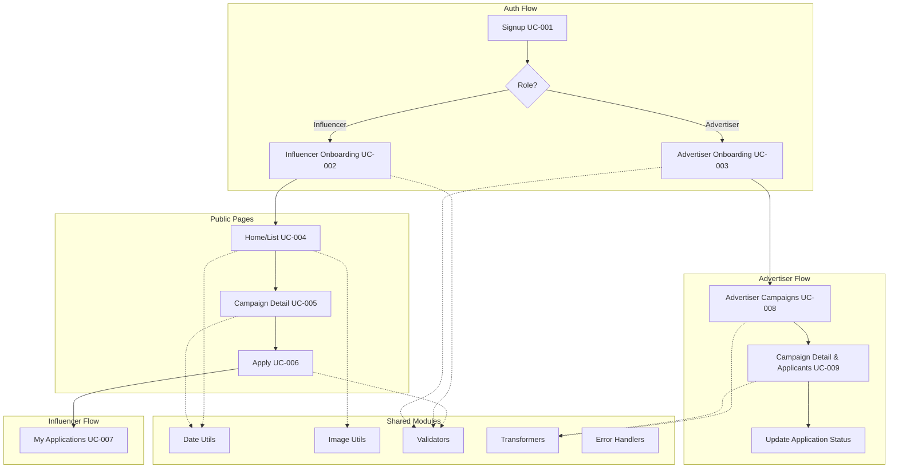

# 전체 유스케이스 구현 마스터 플랜

9개 유스케이스의 모듈화 설계 및 구현 계획 통합 문서

---

## 전체 아키텍처 개요

### Feature 구조

```
src/features/
├── auth/                    # UC-001: 회원가입 & 인증
├── onboarding/              # UC-002, UC-003: 온보딩
│   ├── influencer/          # UC-002: 인플루언서 정보 등록
│   └── advertiser/          # UC-003: 광고주 정보 등록
├── campaigns/               # UC-004, UC-005: 체험단 공개 기능
│   ├── list/                # UC-004: 홈 & 목록 탐색
│   └── detail/              # UC-005: 체험단 상세
├── applications/            # UC-006, UC-007: 지원 기능
│   ├── apply/               # UC-006: 체험단 지원
│   └── my-applications/     # UC-007: 내 지원 목록
└── advertiser/              # UC-008, UC-009: 광고주 관리
    ├── campaigns/           # UC-008: 광고주 체험단 관리
    └── applicants/          # UC-009: 지원자 관리
```

---

## 공통 Shared 모듈

### 1. 데이터 변환 유틸리티

**위치**: `src/lib/transformers/`

```typescript
// src/lib/transformers/campaign.ts
export const transformCampaignRow = (row: CampaignRow): Campaign => {
  return {
    id: row.id,
    title: row.title,
    category: row.category,
    thumbnailUrl: row.thumbnail_url || fallbackImage(row.id),
    startDate: row.start_date,
    endDate: row.end_date,
    maxApplicants: row.max_applicants,
    applicantsCount: row.applicants_count,
    viewCount: row.view_count,
    status: row.status,
    dDay: calculateDDay(row.end_date),
  };
};

// src/lib/transformers/application.ts
export const transformApplicationRow = (row: ApplicationRow): Application => {
  // ...
};
```

### 2. 날짜 유틸리티

**위치**: `src/lib/utils/date.ts`

```typescript
import { differenceInDays, format, isAfter, isBefore } from 'date-fns';
import { ko } from 'date-fns/locale';

export const calculateDDay = (endDate: string): number => {
  return differenceInDays(new Date(endDate), new Date());
};

export const formatDate = (date: string, formatStr: string = 'yyyy-MM-dd'): string => {
  return format(new Date(date), formatStr, { locale: ko });
};

export const isExpired = (endDate: string): boolean => {
  return isBefore(new Date(endDate), new Date());
};
```

### 3. 이미지 유틸리티

**위치**: `src/lib/utils/image.ts`

```typescript
export const fallbackImage = (seed: string): string => {
  return `https://picsum.photos/seed/${encodeURIComponent(seed)}/800/600`;
};

export const placeholderThumbnail = 'https://picsum.photos/800/600?blur=2';
```

### 4. 검증 유틸리티

**위치**: `src/lib/validators/`

```typescript
// business-number.ts
export const validateBusinessNumber = (number: string): boolean => {
  // 체크섬 알고리즘 검증
  const cleaned = number.replace(/-/g, '');
  if (cleaned.length !== 10) return false;

  const weights = [1, 3, 7, 1, 3, 7, 1, 3, 5];
  let sum = 0;
  for (let i = 0; i < 9; i++) {
    sum += parseInt(cleaned[i]) * weights[i];
  }
  const checkDigit = (10 - (sum % 10)) % 10;
  return checkDigit === parseInt(cleaned[9]);
};

// url.ts
export const validateSNSUrl = (type: string, url: string): boolean => {
  const patterns = {
    naver: /^https:\/\/blog\.naver\.com\/.+$/,
    youtube: /^https:\/\/(www\.)?youtube\.com\/@.+$/,
    instagram: /^https:\/\/(www\.)?instagram\.com\/.+$/,
    threads: /^https:\/\/(www\.)?threads\.net\/@.+$/,
  };
  return patterns[type]?.test(url) || false;
};
```

### 5. 에러 핸들러

**위치**: `src/lib/errors/handler.ts`

```typescript
export const handleApiError = (error: unknown, fallbackMessage: string): string => {
  if (isAxiosError(error)) {
    return extractApiErrorMessage(error, fallbackMessage);
  }
  if (error instanceof Error) {
    return error.message;
  }
  return fallbackMessage;
};
```

---

## UC별 모듈 설계 요약

### UC-001: 회원가입 & 역할선택

**Features**: `auth/`

**핵심 모듈**:
- Backend: `route.ts`, `service.ts`, `schema.ts`, `error.ts`
- Frontend: `signup-form.tsx`, `role-selector.tsx`, `terms-agreement.tsx`, `useSignup.ts`
- Page: `app/signup/page.tsx`

**상세 계획**: [docs/001/plan.md 참조](#)

---

### UC-002: 인플루언서 정보 등록

**Features**: `onboarding/influencer/`

**핵심 모듈**:

| 모듈 | 위치 | 설명 |
|------|------|------|
| Influencer Onboarding Route | `features/onboarding/influencer/backend/route.ts` | 인플루언서 프로필 등록 API |
| Influencer Service | `features/onboarding/influencer/backend/service.ts` | SNS 채널 검증, 프로필 생성 로직 |
| Influencer Schema | `features/onboarding/influencer/backend/schema.ts` | 프로필 요청/응답 스키마 |
| Onboarding Form | `features/onboarding/influencer/components/onboarding-form.tsx` | 프로필 입력 폼 |
| SNS Channel Input | `features/onboarding/influencer/components/sns-channel-input.tsx` | SNS 채널 추가/삭제 컴포넌트 |
| Category Selector | `features/onboarding/influencer/components/category-selector.tsx` | 활동 카테고리 선택 |

**주요 로직**:
- SNS 채널 JSONB 배열 처리
- URL 중복 체크 (전체 플랫폼 대상)
- 만 14세 이상 검증
- 최소 1개, 최대 4개 채널 제한

---

### UC-003: 광고주 정보 등록

**Features**: `onboarding/advertiser/`

**핵심 모듈**:

| 모듈 | 위치 | 설명 |
|------|------|------|
| Advertiser Onboarding Route | `features/onboarding/advertiser/backend/route.ts` | 광고주 프로필 등록 API |
| Advertiser Service | `features/onboarding/advertiser/backend/service.ts` | 사업자번호 검증, 지오코딩 로직 |
| Address Search | `features/onboarding/advertiser/components/address-search.tsx` | Daum Postcode 연동 컴포넌트 |
| Business Form | `features/onboarding/advertiser/components/business-form.tsx` | 사업자 정보 입력 폼 |

**주요 로직**:
- 사업자등록번호 체크섬 검증
- 사업자번호 중복 확인
- Daum Postcode API 연동
- Geocoding API로 좌표 추출 (선택)
- 비동기 국세청 API 검증 (선택)

---

### UC-004: 홈 & 체험단 목록 탐색

**Features**: `campaigns/list/`

**핵심 모듈**:

| 모듈 | 위치 | 설명 |
|------|------|------|
| Campaign List Route | `features/campaigns/list/backend/route.ts` | 체험단 목록 조회 API (필터, 정렬, 검색, 페이지네이션) |
| Campaign List Service | `features/campaigns/list/backend/service.ts` | Supabase 쿼리 빌더 로직 |
| Campaign Card | `features/campaigns/list/components/campaign-card.tsx` | 체험단 카드 컴포넌트 |
| Filter Bar | `features/campaigns/list/components/filter-bar.tsx` | 카테고리, 지역 필터 |
| Search Bar | `features/campaigns/list/components/search-bar.tsx` | 검색창 (디바운싱) |
| Sort Dropdown | `features/campaigns/list/components/sort-dropdown.tsx` | 정렬 옵션 |
| Infinite Scroll | `features/campaigns/list/hooks/useCampaignList.ts` | 무한 스크롤 hook |

**주요 로직**:
- 복합 필터링 (category + region + search)
- 정렬 (최신순, 마감임박순, 인기순)
- 디바운싱 검색 (300ms)
- 무한 스크롤 (Intersection Observer, 20개씩)
- URL 쿼리 파라미터 동기화

---

### UC-005: 체험단 상세

**Features**: `campaigns/detail/`

**핵심 모듈**:

| 모듈 | 위치 | 설명 |
|------|------|------|
| Campaign Detail Route | `features/campaigns/detail/backend/route.ts` | 체험단 상세 조회 API, 조회수 증가 |
| Campaign Detail Service | `features/campaigns/detail/backend/service.ts` | 체험단 + 업체 정보 JOIN |
| Campaign Header | `features/campaigns/detail/components/campaign-header.tsx` | 썸네일, 제목, 상태 배지 |
| Campaign Info | `features/campaigns/detail/components/campaign-info.tsx` | 혜택, 미션, 주의사항 (HTML 렌더링) |
| Store Info | `features/campaigns/detail/components/store-info.tsx` | 매장 정보, 지도 표시 |
| Image Gallery | `features/campaigns/detail/components/image-gallery.tsx` | 추가 이미지 갤러리 |
| Apply Button | `features/campaigns/detail/components/apply-button.tsx` | 지원하기 버튼 (조건부 표시) |

**주요 로직**:
- HTML 콘텐츠 sanitize (DOMPurify)
- 지도 API 연동 (Kakao/Naver Map)
- 지원 가능 여부 판단 (로그인, 역할, 상태, 중복 확인)
- 조회수 비동기 증가
- SSR 최적화 (SEO)

---

### UC-006: 체험단 지원

**Features**: `applications/apply/`

**핵심 모듈**:

| 모듈 | 위치 | 설명 |
|------|------|------|
| Application Route | `features/applications/apply/backend/route.ts` | 지원서 제출 API (트랜잭션 처리) |
| Application Service | `features/applications/apply/backend/service.ts` | 지원 생성, 중복 확인, applicants_count 증가 |
| Apply Form | `features/applications/apply/components/apply-form.tsx` | 지원서 작성 폼 |
| SNS Channel Select | `features/applications/apply/components/sns-channel-select.tsx` | 등록된 SNS 채널 선택 |
| Date Picker | `features/applications/apply/components/date-picker.tsx` | 방문 희망 날짜 선택 |
| useApply Hook | `features/applications/apply/hooks/useApply.ts` | 지원 mutation hook |

**주요 로직**:
- 트랜잭션으로 INSERT + UPDATE 원자성 보장
- 동시성 제어 (FOR UPDATE)
- 중복 지원 방지
- 모집 인원 초과 확인
- 비동기 알림 큐잉 (광고주에게)

---

### UC-007: 내 지원 목록

**Features**: `applications/my-applications/`

**핵심 모듈**:

| 모듈 | 위치 | 설명 |
|------|------|------|
| My Applications Route | `features/applications/my-applications/backend/route.ts` | 본인 지원 목록 조회 API |
| My Applications Service | `features/applications/my-applications/backend/service.ts` | applications + campaigns + advertiser_profiles JOIN |
| Application Card | `features/applications/my-applications/components/application-card.tsx` | 지원 내역 카드 |
| Status Tabs | `features/applications/my-applications/components/status-tabs.tsx` | 상태별 탭 (전체, 대기, 선정, 탈락) |
| Application Detail Modal | `features/applications/my-applications/components/application-detail-modal.tsx` | 지원 상세 모달 |
| useMyApplications Hook | `features/applications/my-applications/hooks/useMyApplications.ts` | 목록 조회 hook |

**주요 로직**:
- 상태별 필터링 (pending, selected, rejected)
- URL 쿼리 파라미터 동기화
- 삭제된 체험단 처리 (회색 표시)
- 무한 스크롤 또는 페이지네이션

---

### UC-008: 광고주 체험단 관리

**Features**: `advertiser/campaigns/`

**핵심 모듈**:

| 모듈 | 위치 | 설명 |
|------|------|------|
| Advertiser Campaigns Route | `features/advertiser/campaigns/backend/route.ts` | 본인 체험단 목록 조회, 등록, 수정, 삭제 API |
| Advertiser Campaigns Service | `features/advertiser/campaigns/backend/service.ts` | 체험단 CRUD, applicants_count 집계 |
| Campaign List | `features/advertiser/campaigns/components/campaign-list.tsx` | 체험단 목록 |
| Campaign Card | `features/advertiser/campaigns/components/campaign-card.tsx` | 체험단 카드 (수정/삭제 액션 포함) |
| Campaign Form | `features/advertiser/campaigns/components/campaign-form.tsx` | 체험단 등록/수정 폼 |
| Status Tabs | `features/advertiser/campaigns/components/status-tabs.tsx` | 모집중/모집종료 탭 |

**주요 로직**:
- 본인 체험단만 조회 (advertiser_id = user_id)
- Soft delete (deleted_at)
- 상태 자동 업데이트 (end_date 기준)
- 지원자 있는 체험단 삭제 시 경고

---

### UC-009: 광고주 체험단 상세 & 모집 관리

**Features**: `advertiser/applicants/`

**핵심 모듈**:

| 모듈 | 위치 | 설명 |
|------|------|------|
| Applicants Route | `features/advertiser/applicants/backend/route.ts` | 지원자 목록 조회, 선정/탈락 처리 API |
| Applicants Service | `features/advertiser/applicants/backend/service.ts` | applications 상태 변경, 피드백 저장 |
| Applicant List | `features/advertiser/applicants/components/applicant-list.tsx` | 지원자 목록 |
| Applicant Card | `features/advertiser/applicants/components/applicant-card.tsx` | 지원자 카드 (선정/탈락 버튼) |
| Applicant Detail Modal | `features/advertiser/applicants/components/applicant-detail-modal.tsx` | 지원자 상세 정보 모달 |
| Status Tabs | `features/advertiser/applicants/components/status-tabs.tsx` | 대기/선정/탈락 탭 |
| useUpdateApplicationStatus | `features/advertiser/applicants/hooks/useUpdateApplicationStatus.ts` | 상태 변경 mutation hook |

**주요 로직**:
- 지원자 상태 변경 (pending → selected/rejected)
- 피드백 메시지 저장
- 선정 인원 초과 경고
- 비동기 알림 큐잉 (인플루언서에게)
- 낙관적 업데이트 (Optimistic Update)

---

## 전체 모듈 관계도



---

## 데이터베이스 접근 패턴

### 1. 복합 인덱스 활용

```sql
-- campaigns 테이블 쿼리 최적화
CREATE INDEX idx_campaigns_status_end_date_created
ON campaigns(status, end_date, created_at DESC)
WHERE deleted_at IS NULL;

-- applications 테이블 쿼리 최적화
CREATE INDEX idx_applications_influencer_status
ON applications(influencer_id, status, created_at DESC)
WHERE deleted_at IS NULL;

CREATE INDEX idx_applications_campaign_status
ON applications(campaign_id, status, created_at DESC)
WHERE deleted_at IS NULL;
```

### 2. JSONB 필드 쿼리

```typescript
// SNS 채널 URL 중복 체크
const { data } = await supabase
  .from('influencer_profiles')
  .select('id')
  .contains('sns_channels', [{ url: newUrl }]);

// 카테고리 배열 검색
const { data } = await supabase
  .from('influencer_profiles')
  .select('*')
  .overlaps('categories', ['음식', '카페']);
```

### 3. 트랜잭션 패턴

```typescript
// 체험단 지원 시 트랜잭션
const { data, error } = await supabase.rpc('apply_to_campaign', {
  p_campaign_id: campaignId,
  p_influencer_id: userId,
  p_message: message,
  p_visit_date: visitDate,
  p_selected_sns_channel: snsChannel,
});
```

---

## 에러 처리 전략

### 1. Error Code 체계

```typescript
// features/[feature]/backend/error.ts
export const featureErrorCodes = {
  // 4xx Client Errors
  notFound: 'RESOURCE_NOT_FOUND',
  invalidInput: 'INVALID_INPUT',
  unauthorized: 'UNAUTHORIZED',
  forbidden: 'FORBIDDEN',
  conflict: 'CONFLICT',

  // 5xx Server Errors
  databaseError: 'DATABASE_ERROR',
  externalApiError: 'EXTERNAL_API_ERROR',
  internalError: 'INTERNAL_ERROR',
} as const;
```

### 2. 프론트엔드 에러 핸들링

```typescript
// 공통 에러 토스트
const { toast } = useToast();

try {
  await mutate(data);
} catch (error) {
  const message = handleApiError(error, '요청 처리에 실패했습니다.');
  toast({
    title: '오류',
    description: message,
    variant: 'destructive',
  });
}
```

---

## 성능 최적화 전략

### 1. 프론트엔드

- React Query로 서버 상태 캐싱 (staleTime: 60초)
- 이미지 lazy loading (`loading="lazy"`)
- 무한 스크롤로 초기 로딩 속도 개선
- 코드 스플리팅 (Dynamic Import)

### 2. 백엔드

- Supabase 복합 인덱스 활용
- SELECT 필드 최소화 (필요한 컬럼만)
- JOIN 최소화 (필요 시만)
- 페이지네이션 (Offset 또는 Cursor 기반)

### 3. 데이터베이스

- 조회수 업데이트 비동기 처리
- 배치 작업으로 상태 자동 업데이트 (end_date 기준)
- Connection pooling 최적화

---

## 테스트 전략

### 1. Unit Tests (Backend)

- Zod 스키마 검증 테스트
- Service 로직 테스트 (Supabase 모킹)
- 에러 처리 테스트

### 2. Integration Tests (Frontend)

- React Hook Form 유효성 검증 테스트
- React Query 훅 테스트
- 컴포넌트 인터랙션 테스트

### 3. E2E Tests

- 회원가입 → 온보딩 → 메인 플로우
- 체험단 탐색 → 상세 → 지원 플로우
- 광고주 체험단 등록 → 지원자 관리 플로우

---

## 배포 및 운영

### 1. 환경 변수

```env
# Supabase
NEXT_PUBLIC_SUPABASE_URL=https://xxx.supabase.co
NEXT_PUBLIC_SUPABASE_ANON_KEY=xxx
SUPABASE_SERVICE_ROLE_KEY=xxx

# API
NEXT_PUBLIC_API_BASE_URL=/api

# External APIs (선택)
DAUM_POSTCODE_API_KEY=xxx
KAKAO_MAP_API_KEY=xxx
GEOCODING_API_KEY=xxx
```

### 2. Migration 실행

```bash
# Supabase CLI로 migration 적용
supabase db push

# Seed 데이터 적용 (개발 환경만)
psql -h xxx.supabase.co -U postgres -d postgres -f supabase/migrations/20250930000002_seed_data.sql
```

### 3. 모니터링

- Supabase Dashboard로 쿼리 성능 모니터링
- Vercel Analytics로 프론트엔드 성능 추적
- Sentry로 에러 트래킹 (선택)

---

## 다음 단계

1. **Phase 1**: Auth + Onboarding (UC-001, UC-002, UC-003)
2. **Phase 2**: Campaign Public Pages (UC-004, UC-005)
3. **Phase 3**: Application Flow (UC-006, UC-007)
4. **Phase 4**: Advertiser Dashboard (UC-008, UC-009)

각 Phase별로 Backend → Frontend → Test 순서로 구현